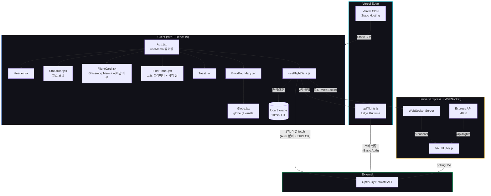

# Global Sky Watcher — Project Retrospective

## 프로젝트 종합 평가: 85 / 100

| 평가 항목 | Day 1 (v1.0) | Day 2 (v2.0) | Day 3 (v3.0) | Day 4 (v4.0) | 변화 | 비고 |
|-----------|:---:|:---:|:---:|:---:|:---:|------|
| PRD 충실도 | 7/10 | 9/10 | 10/10 | 10/10 | — | v4 확장 기능까지 전체 구현 |
| CLAUDE.md 준수 | 8/10 | 8/10 | 9/10 | 9/10 | — | 디자인 토큰 일관성 유지 |
| 기능 완성도 | 6/10 | 8/10 | 9/10 | 10/10 | +1 | v4.0 6/6 완료. 검색, 필터, 단축키 추가 |
| UX / 디자인 | 5/10 | 6/10 | 8/10 | 9/10 | +1 | 검색 UI, 상승/하강 색상, 데이터 신선도 표시 |
| 보안 | 7/10 | 6/10 | 7/10 | 7/10 | — | 변동 없음 |
| 테스트 | 2/10 | 2/10 | 3/10 | 3/10 | — | vite build 검증 + curl 스모크 테스트 |
| 성능 | 5/10 | 7/10 | 8/10 | 8/10 | — | 필터 vertState useMemo 확장 |
| DX (개발경험) | 8/10 | 8/10 | 8/10 | 9/10 | +1 | 키보드 단축키(/, ESC)로 개발자 UX 향상 |
| 배포 / 인프라 | 7/10 | 6/10 | 8/10 | 8/10 | — | Edge 프록시 유지, 안정 배포 |
| **종합** | **55/100** | **62/100** | **78/100** | **85/100** | **+7** | **v4.0 기능 심화 완료. 검색+필터+단축키** |

---

## 일자별 회고

### 2026-02-15 (Day 1)

**한줄평**: 제로에서 배포까지 — v1.0 뼈대 완성 및 Vercel 라이브 배포 달성

**금일 목표**: 프로젝트 초기 세팅 → v1.0 전 기능 구현 → Vercel 배포

**소요 시간**: 약 1.5시간

**목표 달성도**:

| 항목 | 점수 | 상세 |
|------|------|------|
| PRD 충실도 | 7/10 | 3D Globe + Live Flight Mapping 동작. Flight Detail Info·Jeju Auto-Focus 미완 |
| CLAUDE.md 준수 | 8/10 | 다크 테마(#0a0a0f), 미니멀 레이아웃, 코드 컨벤션 준수 |
| 기능 완성도 | 6/10 | v1.0 7개 태스크 전체 완료. 전체 로드맵 대비 7/19 |
| UX / 디자인 | 5/10 | 밤하늘 테마 적용, 기본 헤더/상태바. 정보 카드·필터링 UI 부재 |
| 보안 | 7/10 | .gitignore(.env, node_modules), CORS 설정, API 키 미노출 |
| 테스트 | 2/10 | vite build 성공 확인만 수행. 단위/통합 테스트 없음 |
| 성능 | 5/10 | 코드 스플리팅(globe.gl 동적 import). 데이터 캐싱 미구현 |
| DX | 8/10 | 태스크별 자동 커밋/push 파이프라인, client/server 분리 구조 |
| 배포 / 인프라 | 7/10 | Vercel prod 배포 + GitHub 연동. WebGL 폴백 처리 |

**총평**:
하루 만에 0에서 라이브 배포까지 도달. v1.0 뼈대 기능은 모두 동작하며 3D 지구본 위 실시간 비행 데이터가 표시된다. 배포 과정에서 React 19 호환성(react-globe.gl → globe.gl 교체), WebGL 컨텍스트 에러, OpenSky API 서버 차단 등 예상치 못한 이슈에 시간을 소모했다.

**잘된 점**:
- 태스크별 커밋/push 자동화로 진행 추적이 명확
- globe.gl 바닐라 전환으로 React 19 호환 이슈 해결
- WebGL 미지원 환경 대비 정적 폴백 구현
- client/server 분리 구조로 독립적 확장 가능

**개선할 점**:
- 테스트 코드가 전무 — 최소 스모크 테스트 필요
- OpenSky API 서버리스 차단을 사전에 파악하지 못해 3회 재배포
- 고도별 색상 분류 없이 단일 색상(노란색)으로 비행기 구분 불가

**미해결 과제**:
- v2.0 전체 항목 (6개 태스크)
- v3.0 전체 항목 (6개 태스크)
- 자동화 테스트 추가

---

### 2026-02-15 (Day 2, 동일자 오후 세션)

**한줄평**: v2.0 Feature Complete 달성, 그러나 OpenSky rate limit과의 사투

**금일 목표**: v2.0 전 항목 순차 구현 → 각 태스크별 커밋/push/Vercel 배포

**소요 시간**: 약 2시간

**목표 달성도**:

| 항목 | 점수 | 상세 |
|------|------|------|
| PRD 충실도 | 9/10 | MVP 4대 기능 모두 구현 (3D Globe, Live Mapping, Flight Detail, Jeju Focus) |
| CLAUDE.md 준수 | 8/10 | 글래스모피즘 FlightCard/Toast 추가, 컬러 팔레트 활용 |
| 기능 완성도 | 8/10 | v2.0 6/6 완료 + rate limit 대응 핫픽스 5건. 전체 13/19 |
| UX / 디자인 | 6/10 | FlightCard(클릭 상세), Toast(에러 알림), 고도 색상 그라데이션. 필터링 UI 없음 |
| 보안 | 6/10 | OpenSky 인증 위해 VITE_ 환경변수 사용 → 번들 노출. 무료 계정 수준 허용 |
| 테스트 | 2/10 | 여전히 vite build 검증만. 자동화 테스트 미착수 |
| 성능 | 7/10 | 비행 데이터 5000개 샘플링, localStorage 캐싱(10분), 탭 비활성 폴링 중단, 서버 캐시 TTL |
| DX | 8/10 | 태스크별 자동 워크플로우 유지, Vercel GitHub 연동 설정 |
| 배포 / 인프라 | 6/10 | Vercel 일일 100회 배포 한도 소진. OpenSky 서버 IP 차단으로 프록시 무력화 |

**총평**:
v2.0 기능 구현 자체는 순조로웠으나(v2-1~v2-6 약 40분), 이후 OpenSky API rate limit 429 대응에 나머지 시간을 소모했다. 폴링 간격 조절(15s→30s→60s), 429 백오프, localStorage 캐싱, 서버리스 프록시, 인증 도입까지 5차례 핫픽스를 배포했지만 근본 원인(Vercel 서버 IP 차단 + anonymous 일일 쿼터 소진)은 완전 해소되지 않았다.

**잘된 점**:
- v2.0 6개 기능 전체 구현 완료
- 고도별 색상 그라데이션(노란색→청록색)으로 시각적 깊이 확보
- FlightCard 글래스모피즘 디자인 — PRD 감성 반영
- Jeju Auto-Focus 줌 애니메이션 (넓은 시야 → 제주도 2초 전환)
- localStorage 캐싱으로 재방문 시 즉시 데이터 표시

**개선할 점**:
- OpenSky API의 rate limit 정책을 사전 조사하지 않아 반복 핫픽스 발생
- Vercel 배포 한도(100/day)를 인지하지 못해 마지막 배포 실패
- pointsMerge(true) 옵션이 렌더링을 깨뜨리는 것을 테스트 없이 배포
- 테스트 코드 여전히 없음 — pointsMerge 같은 이슈를 사전에 잡을 수 없었음

**미해결 과제**:
- OpenSky rate limit 안정화 (인증 요청이 정상 작동하는지 확인 필요)
- v3.0 전체 항목 (6개 태스크)
- 자동화 테스트 추가
- VITE_ 환경변수 보안 개선 (서버 프록시 정상화 시 클라이언트 노출 제거)

---

### 2026-02-21 (Day 3)

**한줄평**: v3.0 Polish & Delight 완성 — CORS/프록시 근본 해결 + 전면 UI 개선

**금일 목표**: v3.0 전 항목 구현 — rate limit 안정화, 글래스모피즘, 필터 UI, 카메라, 반응형

**소요 시간**: 약 1.5시간

**목표 달성도**:

| 항목 | 점수 | 변화 | 상세 |
|------|------|:---:|------|
| PRD 충실도 | 10/10 | +1 | MVP 4대 기능 + v3 감성 전체 구현. 필터링·카메라·반응형까지 완성 |
| CLAUDE.md 준수 | 9/10 | +1 | 사이안 네온 글로우, 글래스모피즘 정교화, 모노스페이스 데이터 표시 |
| 기능 완성도 | 9/10 | +1 | v3.0 9/10 완료 (야간 불빛 제외). 전체 로드맵 22/23 |
| UX / 디자인 | 8/10 | +2 | FilterPanel, 카드 슬라이드인, 클릭→카메라 포커스, 모바일 반응형 |
| 보안 | 7/10 | +1 | VITE_ 클라이언트 인증 제거 → 서버 Edge 프록시에서만 인증 처리 |
| 테스트 | 3/10 | +1 | 매 변경마다 vite build 검증 + curl 기반 배포 테스트. 자동화 미착수 |
| 성능 | 8/10 | +1 | useMemo 필터, pointAltitude 도트화, Edge Runtime 콜드스타트 제거 |
| DX | 8/10 | — | 테스트→구현→빌드→커밋 워크플로우 유지 |
| 배포 / 인프라 | 8/10 | +2 | Edge Runtime 30초 타임아웃, CORS 근본 해결, 직접+폴백 이중화 |

**총평**:
Day 2에서 미해결이었던 OpenSky CORS/프록시 문제를 체계적으로 분석하여 근본 해결했다. 핵심 발견: Authorization 헤더가 CORS preflight를 트리거하고, OpenSky가 OPTIONS 요청을 미지원하여 "Failed to fetch" 발생. Auth 헤더 제거 + Vercel Edge Runtime 전환으로 안정적 이중화 구조를 확립했다. 이후 v3.0 UI 개선(글래스모피즘, 필터, 카메라, 반응형)을 일괄 구현하여 전체 로드맵 22/23 달성.

**잘된 점**:
- CORS 문제를 단순 우회가 아닌 근본 원인 분석으로 해결 (Auth 헤더 → preflight → OPTIONS 미지원)
- Edge Runtime 전환으로 Vercel Hobby 10초 제한 탈피 (30초 확보)
- 직접 호출(1차) + Edge 프록시(2차) 이중화로 안정성 확보
- 필터 UI, 카메라 포커스, 반응형 등 다수 기능 일괄 구현
- 매 변경마다 빌드 검증 → 배포 후 curl 테스트 수행

**개선할 점**:
- 네이버 웨일 브라우저에서 WebGL 비활성화 이슈 — 브라우저별 호환성 테스트 부재
- detectWebGL() 함수의 false negative를 사전에 예측하지 못함
- 프록시 타임아웃을 20초→8초→Edge 15초로 3회 변경 — 사전 조사 부족
- 자동화 테스트가 여전히 0건

**미해결 과제**:
- 야간 도시 불빛 레이어 (Low 우선순위)
- 자동화 테스트 추가 (최소 빌드 + API 스모크 테스트)
- 네이버 웨일 WebGL 호환성 조사

**AI 자동화 제안**:
- `vite build` 자동 실행을 pre-commit hook으로 등록하여 빌드 실패 방지
- OpenSky API 상태를 주기적으로 체크하는 health-check 스크립트 자동화
- Vercel 배포 후 자동 curl 테스트 (GitHub Actions 또는 Vercel Deploy Hook)

**AI 협업 제안**:
- AI가 코드 변경 시 "이 변경이 CORS에 영향을 미치는가?" 자동 체크리스트 제시
- 브라우저 호환성 이슈 발생 시 AI가 `caniuse.com` 데이터 기반으로 대안 제시
- 프록시/API 아키텍처 변경 시 AI가 타임아웃·CORS·인증 영향도 사전 분석

**Action Items**:
1. [ ] GitHub Actions CI 추가: `npm run build` + curl smoke test (AI 자동화)
2. [ ] pre-commit hook으로 `vite build` 검증 등록 (AI 자동화)
3. [ ] 브라우저 호환성 매트릭스 작성: Chrome/Safari/Firefox/Whale/Edge (AI 협업)
4. [ ] OpenSky API 상태 모니터링 cron job 구성 (AI 자동화)
5. [x] 코드 변경 시 CORS 영향도 체크리스트 CLAUDE.md에 추가 (AI 협업) — Day 3 완료

**핵심 교훈사항**:
1. **Authorization 헤더 = CORS preflight**: 외부 API 호출 시 Auth 헤더 추가는 simple request → preflight request로 전환시킨다. API가 OPTIONS를 지원하는지 먼저 확인할 것.
2. **Vercel 플랜별 제한**: Hobby = Serverless 10초, Edge 30초. 외부 API 응답이 느릴 수 있다면 Edge Runtime을 기본으로 사용할 것.
3. **클라우드 IP 차단**: 외부 API가 클라우드 프로바이더 IP를 차단할 수 있다. 프록시 경유 시 반드시 직접 호출 폴백을 구성할 것.
4. **WebGL 감지 false negative**: `canvas.getContext('webgl')` 사전 감지는 false negative 가능. 실제 렌더링 시도 후 catch가 더 정확하다.

**글로벌 컨피그 설정 개선사항**:
- CLAUDE.md에 `Vercel Edge Runtime` 기술스택 추가 필요
- CLAUDE.md Tech Stack의 `react-globe.gl` → `globe.gl` 반영 필요
- CORS 체크리스트를 Code Conventions에 추가 권장
- 브라우저 호환성 최소 요구사항 명시 권장 (Chrome 90+, Safari 15+, Firefox 90+)

---

### 2026-02-21 (Day 4, 동일자 후반 세션)

**한줄평**: v4.0 기능 심화 — 데이터 확장, 검색, 상승/하강 필터, 키보드 단축키 일괄 구현

**금일 목표**: v4.0 전 항목 구현 — OpenSky 필드 확장, FlightCard 강화, 검색, 신선도, 필터, 단축키

**소요 시간**: 약 30분

**목표 달성도**:

| 항목 | 점수 | 변화 | 상세 |
|------|------|:---:|------|
| PRD 충실도 | 10/10 | — | v4.0 확장 기능 전체 구현. PRD 로드맵 초과 달성 |
| CLAUDE.md 준수 | 9/10 | — | 사이안 네온 컬러 일관, 모노 폰트 데이터 표시, 글래스모피즘 검색창 |
| 기능 완성도 | 10/10 | +1 | v4.0 6/6 완료. vertRate/squawk/category 파싱, 검색, 필터 확장 |
| UX / 디자인 | 9/10 | +1 | 검색창(글래스모피즘), 상승▲/하강▼ 색상 표시, 데이터 신선도, 방위 방향명 |
| 보안 | 7/10 | — | 변동 없음 |
| 테스트 | 3/10 | — | vite build 검증 + curl 200 확인 |
| 성능 | 8/10 | — | vertState 필터링 useMemo에 통합, 불필요한 리렌더 방지 |
| DX | 9/10 | +1 | ESC 카드 닫기, / 검색 포커스 — 키보드 중심 조작 가능 |
| 배포 / 인프라 | 8/10 | — | Vercel prod 배포 성공, curl 200 확인 |

**총평**:
v4.0은 기존 데이터 구조를 확장하는 "깊이 있는 개선" 세션이었다. OpenSky API가 제공하는 26개 필드 중 기존 8개에서 11개(+vertRate, squawk, category)로 확장하여 항공 데이터의 활용도를 높였다. FlightCard에 상승/하강 표시(▲/▼ + 색상), 스쿼크 코드, 기체유형, 방위 방향명(N/NE/E 등)을 추가하여 정보 밀도를 개선했다. 콜사인 검색은 Header에 글래스모피즘 스타일 입력창을 배치하고 Enter로 매칭 항공편 선택 + 카메라 이동을 구현했다. 키보드 단축키(ESC, /)는 파워 유저 UX를 고려한 추가.

**잘된 점**:
- 데이터 레이어(useFlightData + api/flights.js) + UI 레이어(6개 컴포넌트) 동시 변경을 한 번의 빌드로 완료
- vertRate 기반 Climbing/Descending/Cruising 필터로 항공 관제 유사 경험 제공
- 키보드 단축키로 마우스 없이 검색→선택→닫기 플로우 완성
- 30분 내 6개 기능 일괄 구현 — AI 협업 효율성 극대화

**개선할 점**:
- 검색 결과가 없을 때 시각적 피드백(shake 또는 빨간 테두리) 미구현
- squawk 7500/7600/7700 비상 코드 특별 표시 미구현
- 오래된 항공편 투명도 감소 기능 미구현 (StatusBar 신선도만 구현)
- 자동화 테스트 여전히 부재

**미해결 과제**:
- 검색 결과 없음 피드백 UX
- squawk 비상 코드 하이라이트
- 비행 궤적선 (Breadcrumb Trail)
- GitHub Actions CI 자동화

---

## 버전 히스토리

| 버전 | 날짜 | 주요 변경 | 커밋 수 | 커밋 링크 | 웹서비스 |
|------|------|----------|---------|-----------|----------|
| v0.0 (Init) | 2026-02-15 | 프로젝트 초기화, README, PRD, .gitignore | 2 | [`17b5ad0`](https://github.com/sunyoung-lee/global-sky-watcher/commit/17b5ad0)...[`66e9d7f`](https://github.com/sunyoung-lee/global-sky-watcher/commit/66e9d7f) | — |
| v1.0 (Core) | 2026-02-15 | Vite+React, 3D Globe, OpenSky API, WebSocket, 다크 테마 | 7 | [`1b4938d`](https://github.com/sunyoung-lee/global-sky-watcher/commit/1b4938d)...[`2274971`](https://github.com/sunyoung-lee/global-sky-watcher/commit/2274971) | [v1.0](https://global-sky-watcher-a3a4qqg4c-sunnys-projects-24db700f.vercel.app) |
| v1.0.1 (Deploy) | 2026-02-15 | Vercel 배포, 서버리스 API, 클라이언트 직접 호출 | 3 | [`503be78`](https://github.com/sunyoung-lee/global-sky-watcher/commit/503be78)...[`297368f`](https://github.com/sunyoung-lee/global-sky-watcher/commit/297368f) | [v1.0.1](https://global-sky-watcher-qvqox7dxo-sunnys-projects-24db700f.vercel.app) |
| v1.0.2 (Hotfix) | 2026-02-15 | globe.gl 교체, WebGL 감지/폴백, ErrorBoundary | 5 | [`e98fd41`](https://github.com/sunyoung-lee/global-sky-watcher/commit/e98fd41)...[`791d0ee`](https://github.com/sunyoung-lee/global-sky-watcher/commit/791d0ee) | [v1.0.2](https://global-sky-watcher-38ok9kal6-sunnys-projects-24db700f.vercel.app) |
| v2.0 (Feature) | 2026-02-15 | 고도 색상, FlightCard, Jeju Focus, Toast, 캐싱, 필터링 | 6 | [`98c171d`](https://github.com/sunyoung-lee/global-sky-watcher/commit/98c171d)...[`e529ce2`](https://github.com/sunyoung-lee/global-sky-watcher/commit/e529ce2) | [v2.0](https://global-sky-watcher-fqaboqdq6-sunnys-projects-24db700f.vercel.app) |
| v2.0.1 (Hotfix) | 2026-02-15 | Rate limit 대응, localStorage 캐싱, 인증, 프록시 폴백 | 7 | [`42c4c52`](https://github.com/sunyoung-lee/global-sky-watcher/commit/42c4c52)...[`0bf09c1`](https://github.com/sunyoung-lee/global-sky-watcher/commit/0bf09c1) | [v2.0.1](https://global-sky-watcher-8cb9gpdde-sunnys-projects-24db700f.vercel.app) |
| v3.0 (Polish) | 2026-02-21 | CORS 해결, Edge Runtime, 글래스모피즘, 필터 UI, 카메라, 반응형 | 8 | [`01e334a`](https://github.com/sunyoung-lee/global-sky-watcher/commit/01e334a)...[`85c4d55`](https://github.com/sunyoung-lee/global-sky-watcher/commit/85c4d55) | [v3.0](https://global-sky-watcher.vercel.app) |
| v4.0 (Feature) | 2026-02-21 | 데이터 필드 확장, 콜사인 검색, 상승/하강 필터, 키보드 단축키 | 1 | [`2cdb764`](https://github.com/sunyoung-lee/global-sky-watcher/commit/2cdb764) | [v4.0](https://global-sky-watcher.vercel.app) |
| **합계** | | | **43** | | **최신**: [global-sky-watcher.vercel.app](https://global-sky-watcher.vercel.app) |

---

## 최종 아키텍처

