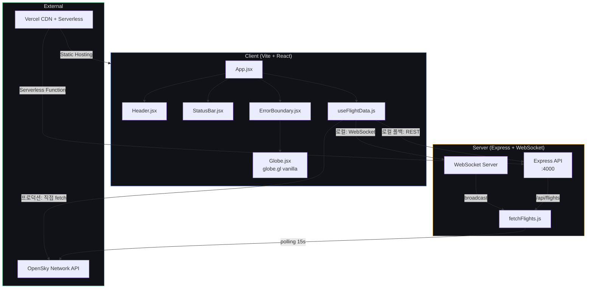

# Global Sky Watcher — Project Retrospective

## 프로젝트 종합 평가

| 평가 항목 | 점수 | 비고 |
|-----------|------|------|
| PRD 충실도 | 7/10 | MVP 4개 기능 중 2개 완성(3D Globe, Live Flight Mapping), 2개 미완(Flight Detail Info, Jeju Auto-Focus 부분 구현) |
| CLAUDE.md 준수 | 8/10 | Sunny Style 다크 테마 적용, 미니멀 레이아웃 구현. 글래스모피즘 카드·에디토리얼 타이포는 미착수 |
| 기능 완성도 | 6/10 | v1.0 뼈대 7/7 완료, v2.0·v3.0 전체 미착수 |
| UX / 디자인 | 5/10 | 다크 테마 + 미니멀 헤더/상태바 적용. 정보 카드, 필터링 UI, 인터랙션 피드백 부재 |
| 보안 | 7/10 | .env gitignore 처리, CORS 설정. API 키 노출 없음. 입력 검증 해당 없음 |
| 테스트 | 2/10 | 자동화 테스트 없음. 수동 빌드 검증만 수행 |
| 성능 | 5/10 | globe.gl 동적 import로 코드 분할 적용. 데이터 캐싱·샘플링 미구현 |
| DX (개발경험) | 8/10 | Vite HMR, 명확한 client/server 분리, 커밋 단위 자동화 워크플로우 |
| 배포 / 인프라 | 7/10 | Vercel 자동 배포, GitHub 연동. 서버리스 API는 OpenSky 차단으로 클라이언트 직접 호출로 전환 |
| **종합** | **55/100** | **v1.0 골격 완성. MVP 수준에는 v2.0 핵심 기능(정보 카드, 고도 색상) 필요** |

---

## 일자별 회고

### 2026-02-15 (Day 1)

**한줄평**: 제로에서 배포까지 — v1.0 뼈대 완성 및 Vercel 라이브 배포 달성

**금일 목표**: 프로젝트 초기 세팅 → v1.0 전 기능 구현 → Vercel 배포

**소요 시간**: 약 1.5시간 (17:28 ~ 17:58, 커밋 기록 기준)

**목표 달성도**:

| 항목 | 점수 | 상세 |
|------|------|------|
| PRD 충실도 | 7/10 | 3D Globe + Live Flight Mapping 동작. Flight Detail Info·Jeju Auto-Focus(시점만 설정) 미완 |
| CLAUDE.md 준수 | 8/10 | 다크 테마(#0a0a0f), 미니멀 레이아웃, 코드 컨벤션 준수 |
| 기능 완성도 | 6/10 | v1.0 7개 태스크 전체 완료. 전체 로드맵 대비 7/19 |
| UX / 디자인 | 5/10 | 밤하늘 테마 적용, 기본 헤더/상태바. 정보 카드·필터링 UI 부재 |
| 보안 | 7/10 | .gitignore(.env, node_modules), CORS 설정, API 키 미노출 |
| 테스트 | 2/10 | vite build 성공 확인만 수행. 단위/통합 테스트 없음 |
| 성능 | 5/10 | 코드 스플리팅(globe.gl 동적 import). 데이터 캐싱 미구현 |
| DX | 8/10 | 태스크별 자동 커밋/push 파이프라인, client/server 분리 구조 |
| 배포 / 인프라 | 7/10 | Vercel prod 배포 + GitHub 자동 연동. WebGL 폴백 처리 |

**총평**:
하루 만에 0에서 라이브 배포까지 도달. v1.0 뼈대 기능은 모두 동작하며 3D 지구본 위 실시간 비행 데이터가 표시된다. 다만 배포 과정에서 React 19 호환성(react-globe.gl → globe.gl 교체), WebGL 컨텍스트 에러, OpenSky API 서버 차단 등 예상치 못한 이슈에 시간을 소모했다.

**잘된 점**:
- 태스크별 커밋/push 자동화로 진행 추적이 명확
- globe.gl 바닐라 전환으로 React 19 호환 이슈 해결
- WebGL 미지원 환경 대비 정적 폴백 구현
- client/server 분리 구조로 독립적 확장 가능

**개선할 점**:
- 테스트 코드가 전무 — 최소 스모크 테스트 필요
- OpenSky API 서버리스 차단을 사전에 파악하지 못해 3회 재배포
- 고도별 색상 분류 없이 단일 색상(노란색)으로 비행기 구분 불가
- Flight Detail Info 카드 미구현으로 데이터 소비 경험 부족

**미해결 과제**:
- [ ] Flight Detail Info (비행기 클릭 → 상세 카드)
- [ ] 고도별 색상 그라데이션
- [ ] Jeju Auto-Focus 애니메이션 (현재 시점만 설정, 부드러운 줌 없음)
- [ ] 자동화 테스트 추가
- [ ] CLAUDE.md의 Tech Stack에 `react-globe.gl` → `globe.gl` 반영 필요

---

## 버전 히스토리

| 버전 | 날짜 | 주요 변경 | 커밋 수 | 커밋 링크 | 웹서비스 |
|------|------|----------|---------|-----------|----------|
| v0.0 (Init) | 2026-02-15 | 프로젝트 초기화, README, PRD, .gitignore | 2 | [`17b5ad0`](https://github.com/sunyoung-lee/global-sky-watcher/commit/17b5ad0)...[`66e9d7f`](https://github.com/sunyoung-lee/global-sky-watcher/commit/66e9d7f) | — |
| v1.0 (Core) | 2026-02-15 | Vite+React 세팅, 3D Globe, OpenSky API, WebSocket 서버, 다크 테마 | 7 | [`1b4938d`](https://github.com/sunyoung-lee/global-sky-watcher/commit/1b4938d)...[`2274971`](https://github.com/sunyoung-lee/global-sky-watcher/commit/2274971) | [v1.0 배포](https://global-sky-watcher-a3a4qqg4c-sunnys-projects-24db700f.vercel.app) |
| v1.0.1 (Deploy) | 2026-02-15 | Vercel 배포, 서버리스 API, 클라이언트 직접 OpenSky 호출 | 3 | [`503be78`](https://github.com/sunyoung-lee/global-sky-watcher/commit/503be78)...[`297368f`](https://github.com/sunyoung-lee/global-sky-watcher/commit/297368f) | [v1.0.1 배포](https://global-sky-watcher-qvqox7dxo-sunnys-projects-24db700f.vercel.app) |
| v1.0.2 (Hotfix) | 2026-02-15 | globe.gl 교체, WebGL 감지/폴백, ErrorBoundary | 5 | [`e98fd41`](https://github.com/sunyoung-lee/global-sky-watcher/commit/e98fd41)...[`791d0ee`](https://github.com/sunyoung-lee/global-sky-watcher/commit/791d0ee) | [v1.0.2 배포](https://global-sky-watcher-38ok9kal6-sunnys-projects-24db700f.vercel.app) |
| **합계** | | | **17** | | **최신**: [global-sky-watcher.vercel.app](https://global-sky-watcher.vercel.app) |

---

## 최종 아키텍처

