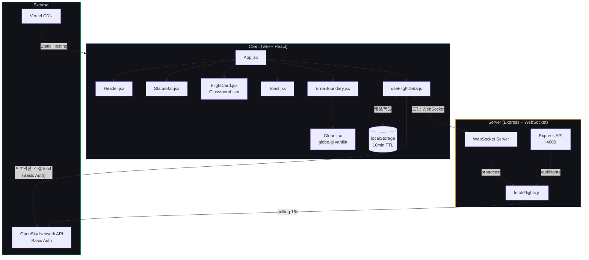

# Global Sky Watcher — Project Retrospective

## 프로젝트 종합 평가: 62 / 100

| 평가 항목 | Day 1 | Day 2 | 변화 | 비고 |
|-----------|-------|-------|------|------|
| PRD 충실도 | 7/10 | 9/10 | +2 | MVP 4대 기능 모두 구현 완료 (Day 2에서 FlightCard, Jeju Auto-Focus 추가) |
| CLAUDE.md 준수 | 8/10 | 8/10 | — | 다크 테마, 미니멀 레이아웃 유지. 글래스모피즘 정교화는 v3.0 대기 |
| 기능 완성도 | 6/10 | 8/10 | +2 | v1.0 7/7 + v2.0 6/6 완료. 전체 로드맵 13/19 |
| UX / 디자인 | 5/10 | 6/10 | +1 | FlightCard, Toast 추가. 필터링 UI·마이크로 인터랙션 미구현 |
| 보안 | 7/10 | 6/10 | -1 | VITE_ 환경변수로 OpenSky 자격증명 클라이언트 번들 노출 (무료 계정 수준 허용) |
| 테스트 | 2/10 | 2/10 | — | 자동화 테스트 없음. vite build 검증만 수행 |
| 성능 | 5/10 | 7/10 | +2 | 데이터 샘플링(5000cap), localStorage 캐싱, 탭 비활성 폴링 중단 |
| DX (개발경험) | 8/10 | 8/10 | — | 태스크별 자동 커밋/push, Vercel GitHub 연동 |
| 배포 / 인프라 | 7/10 | 6/10 | -1 | Vercel 배포 한도 초과(100/day), OpenSky 서버 IP 차단으로 프록시 무력화 |
| **종합** | **55/100** | **62/100** | **+7** | **v2.0 Feature Complete. OpenSky rate limit 이슈가 UX를 저해** |

---

## 일자별 회고

### 2026-02-15 (Day 1)

**한줄평**: 제로에서 배포까지 — v1.0 뼈대 완성 및 Vercel 라이브 배포 달성

**금일 목표**: 프로젝트 초기 세팅 → v1.0 전 기능 구현 → Vercel 배포

**소요 시간**: 약 1.5시간

**목표 달성도**:

| 항목 | 점수 | 상세 |
|------|------|------|
| PRD 충실도 | 7/10 | 3D Globe + Live Flight Mapping 동작. Flight Detail Info·Jeju Auto-Focus 미완 |
| CLAUDE.md 준수 | 8/10 | 다크 테마(#0a0a0f), 미니멀 레이아웃, 코드 컨벤션 준수 |
| 기능 완성도 | 6/10 | v1.0 7개 태스크 전체 완료. 전체 로드맵 대비 7/19 |
| UX / 디자인 | 5/10 | 밤하늘 테마 적용, 기본 헤더/상태바. 정보 카드·필터링 UI 부재 |
| 보안 | 7/10 | .gitignore(.env, node_modules), CORS 설정, API 키 미노출 |
| 테스트 | 2/10 | vite build 성공 확인만 수행. 단위/통합 테스트 없음 |
| 성능 | 5/10 | 코드 스플리팅(globe.gl 동적 import). 데이터 캐싱 미구현 |
| DX | 8/10 | 태스크별 자동 커밋/push 파이프라인, client/server 분리 구조 |
| 배포 / 인프라 | 7/10 | Vercel prod 배포 + GitHub 연동. WebGL 폴백 처리 |

**총평**:
하루 만에 0에서 라이브 배포까지 도달. v1.0 뼈대 기능은 모두 동작하며 3D 지구본 위 실시간 비행 데이터가 표시된다. 배포 과정에서 React 19 호환성(react-globe.gl → globe.gl 교체), WebGL 컨텍스트 에러, OpenSky API 서버 차단 등 예상치 못한 이슈에 시간을 소모했다.

**잘된 점**:
- 태스크별 커밋/push 자동화로 진행 추적이 명확
- globe.gl 바닐라 전환으로 React 19 호환 이슈 해결
- WebGL 미지원 환경 대비 정적 폴백 구현
- client/server 분리 구조로 독립적 확장 가능

**개선할 점**:
- 테스트 코드가 전무 — 최소 스모크 테스트 필요
- OpenSky API 서버리스 차단을 사전에 파악하지 못해 3회 재배포
- 고도별 색상 분류 없이 단일 색상(노란색)으로 비행기 구분 불가

**미해결 과제**:
- v2.0 전체 항목 (6개 태스크)
- v3.0 전체 항목 (6개 태스크)
- 자동화 테스트 추가

---

### 2026-02-15 (Day 2, 동일자 오후 세션)

**한줄평**: v2.0 Feature Complete 달성, 그러나 OpenSky rate limit과의 사투

**금일 목표**: v2.0 전 항목 순차 구현 → 각 태스크별 커밋/push/Vercel 배포

**소요 시간**: 약 2시간

**목표 달성도**:

| 항목 | 점수 | 상세 |
|------|------|------|
| PRD 충실도 | 9/10 | MVP 4대 기능 모두 구현 (3D Globe, Live Mapping, Flight Detail, Jeju Focus) |
| CLAUDE.md 준수 | 8/10 | 글래스모피즘 FlightCard/Toast 추가, 컬러 팔레트 활용 |
| 기능 완성도 | 8/10 | v2.0 6/6 완료 + rate limit 대응 핫픽스 5건. 전체 13/19 |
| UX / 디자인 | 6/10 | FlightCard(클릭 상세), Toast(에러 알림), 고도 색상 그라데이션. 필터링 UI 없음 |
| 보안 | 6/10 | OpenSky 인증 위해 VITE_ 환경변수 사용 → 번들 노출. 무료 계정 수준 허용 |
| 테스트 | 2/10 | 여전히 vite build 검증만. 자동화 테스트 미착수 |
| 성능 | 7/10 | 비행 데이터 5000개 샘플링, localStorage 캐싱(10분), 탭 비활성 폴링 중단, 서버 캐시 TTL |
| DX | 8/10 | 태스크별 자동 워크플로우 유지, Vercel GitHub 연동 설정 |
| 배포 / 인프라 | 6/10 | Vercel 일일 100회 배포 한도 소진. OpenSky 서버 IP 차단으로 프록시 무력화 |

**총평**:
v2.0 기능 구현 자체는 순조로웠으나(v2-1~v2-6 약 40분), 이후 OpenSky API rate limit 429 대응에 나머지 시간을 소모했다. 폴링 간격 조절(15s→30s→60s), 429 백오프, localStorage 캐싱, 서버리스 프록시, 인증 도입까지 5차례 핫픽스를 배포했지만 근본 원인(Vercel 서버 IP 차단 + anonymous 일일 쿼터 소진)은 완전 해소되지 않았다.

**잘된 점**:
- v2.0 6개 기능 전체 구현 완료
- 고도별 색상 그라데이션(노란색→청록색)으로 시각적 깊이 확보
- FlightCard 글래스모피즘 디자인 — PRD 감성 반영
- Jeju Auto-Focus 줌 애니메이션 (넓은 시야 → 제주도 2초 전환)
- localStorage 캐싱으로 재방문 시 즉시 데이터 표시

**개선할 점**:
- OpenSky API의 rate limit 정책을 사전 조사하지 않아 반복 핫픽스 발생
- Vercel 배포 한도(100/day)를 인지하지 못해 마지막 배포 실패
- pointsMerge(true) 옵션이 렌더링을 깨뜨리는 것을 테스트 없이 배포
- 테스트 코드 여전히 없음 — pointsMerge 같은 이슈를 사전에 잡을 수 없었음

**미해결 과제**:
- OpenSky rate limit 안정화 (인증 요청이 정상 작동하는지 확인 필요)
- v3.0 전체 항목 (6개 태스크)
- 자동화 테스트 추가
- VITE_ 환경변수 보안 개선 (서버 프록시 정상화 시 클라이언트 노출 제거)

---

## 버전 히스토리

| 버전 | 날짜 | 주요 변경 | 커밋 수 | 커밋 링크 | 웹서비스 |
|------|------|----------|---------|-----------|----------|
| v0.0 (Init) | 2026-02-15 | 프로젝트 초기화, README, PRD, .gitignore | 2 | [`17b5ad0`](https://github.com/sunyoung-lee/global-sky-watcher/commit/17b5ad0)...[`66e9d7f`](https://github.com/sunyoung-lee/global-sky-watcher/commit/66e9d7f) | — |
| v1.0 (Core) | 2026-02-15 | Vite+React, 3D Globe, OpenSky API, WebSocket, 다크 테마 | 7 | [`1b4938d`](https://github.com/sunyoung-lee/global-sky-watcher/commit/1b4938d)...[`2274971`](https://github.com/sunyoung-lee/global-sky-watcher/commit/2274971) | [v1.0](https://global-sky-watcher-a3a4qqg4c-sunnys-projects-24db700f.vercel.app) |
| v1.0.1 (Deploy) | 2026-02-15 | Vercel 배포, 서버리스 API, 클라이언트 직접 호출 | 3 | [`503be78`](https://github.com/sunyoung-lee/global-sky-watcher/commit/503be78)...[`297368f`](https://github.com/sunyoung-lee/global-sky-watcher/commit/297368f) | [v1.0.1](https://global-sky-watcher-qvqox7dxo-sunnys-projects-24db700f.vercel.app) |
| v1.0.2 (Hotfix) | 2026-02-15 | globe.gl 교체, WebGL 감지/폴백, ErrorBoundary | 5 | [`e98fd41`](https://github.com/sunyoung-lee/global-sky-watcher/commit/e98fd41)...[`791d0ee`](https://github.com/sunyoung-lee/global-sky-watcher/commit/791d0ee) | [v1.0.2](https://global-sky-watcher-38ok9kal6-sunnys-projects-24db700f.vercel.app) |
| v2.0 (Feature) | 2026-02-15 | 고도 색상, FlightCard, Jeju Focus, Toast, 캐싱, 필터링 | 6 | [`98c171d`](https://github.com/sunyoung-lee/global-sky-watcher/commit/98c171d)...[`e529ce2`](https://github.com/sunyoung-lee/global-sky-watcher/commit/e529ce2) | [v2.0](https://global-sky-watcher-fqaboqdq6-sunnys-projects-24db700f.vercel.app) |
| v2.0.1 (Hotfix) | 2026-02-15 | Rate limit 대응, localStorage 캐싱, 인증, 프록시 폴백 | 7 | [`42c4c52`](https://github.com/sunyoung-lee/global-sky-watcher/commit/42c4c52)...[`0bf09c1`](https://github.com/sunyoung-lee/global-sky-watcher/commit/0bf09c1) | [v2.0.1](https://global-sky-watcher-8cb9gpdde-sunnys-projects-24db700f.vercel.app) |
| **합계** | | | **32** | | **최신**: [global-sky-watcher.vercel.app](https://global-sky-watcher.vercel.app) |

---

## 최종 아키텍처

